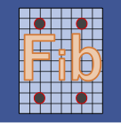
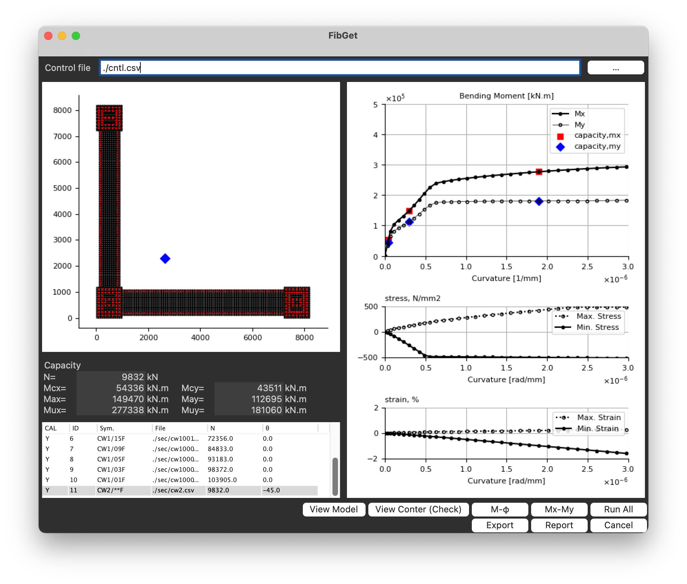

<link href="https://raw.githubusercontent.com/simonlc/Markdown-CSS/master/markdown.css" rel="stylesheet"></link>

# fibGet
1-D Fiber Model Analysis





# Features
- Fiber Model Analysis for the reinforced concrete section
- Concrete: Fafitis and Shah Model
- Steel   : Bi-Linear Model
- Capable of making pdf report

----------------

# Input data/ Sample

Need two file for the analyis

| file | example file name |
|:--|:--|
| control file | cntl.csv |
| section file | sec.csv |


## 1. control file
example csv data

``` txt
title, csvfile, theta, nn, ecumax, ndiv, ecu, esu, come, cuvmax, mumax, stressmax, strainmax, output, cal
CW10045,  ./sec/cw1.csv,    0.0, 8466, 0.003, 100, 0.003, 0.01, Fc60/20-D41(SD490), 2.0E-6, -99, -99, 0.02, ./result/CW10045, N
```

 | parameter | example| remark |
 |---|---|----|
 | title   | CW10045      | title name |
 | csvfile |./sec/cw1.csv | input section file |
 | theta   | 0.0          | angle of increment strain    |
 | nn      | 8466.0       | Axial force in analysis |
 | ecumax  | 0.005        | maximum compressive strain in analysis|
 | ndiv    | 100          | increment divided number |
 | ecu     | 0.003        | ultimate concrete strain limitation  for capacity|
 | esu     | 0.01         | ultimate steel bar strain limitation for capacity|
 | come    | Fc60/20-D41(SD490) | comment for report pdf |
 | cuvmax  | 2.0E-6             | graph control/(-99:auto): curvature (1/mm) |
 | mumax   | -99                | graph control/(-99:auto): bending moment (kN.m) |
 | stressmax |-99               | graph control/(-99:auto): steel bar stress (N/mm2) |
 | strainmax |0.02              | graph control/(-99:auto): steel bar strain (-) |
 | output    |./result/CW10045 | output file name/ need make result dir. |
 | cal       | Y or N          | Y: Done Analysis, N: Need Analysis
----------------


## 2. csvfile/ section file

| Item | Control for |
| -- | :-- |
|MATE| material selection |
|CAPA| allowable capacity |
|FIBE| concrete fiber model |
|REBA| steel bar |

### 2-1. MATE
material select

|item|remark|
|--|:--|
|num| material number as bellow |
|parameter| parameter |

| num | parameter | remark |
|:--|:--|:--|
| =1 | fc(compressive strength) | Concrete (Fafitis and Shah Model) |
| =2 | fy(yield stress) | Steel Bar ( Bi-Linear) |
| =3 | fc(compressive strength) | Concrete (Ignore tension based on num==1)

### 2-2. CAPA
capacity control
|item| remark |
|--|:--|
|num| num. of concrete material |
|fc | allowable concrete strength |
|num| num. of steel bar material |
|fy | yield strength|

### 2-3. FIBE
Concrete fiber geometry
example
``` txt
#, xx1,yy1,xx2,yy2,ndimx,ndimy,fc_id
FIBE,     0.0,    0.0, 1000.0,  950.0,  20, 19, 0
FIBE,  1000.0,    0.0, 2000.0,  950.0,  20, 19, 0
FIBE,  2000.0,    0.0, 3000.0,  950.0,  20, 19, 0
FIBE,     0.0, 8500.0, 1000.0, 9450.0,  20, 19, 0
FIBE,  1000.0, 8500.0, 2000.0, 9450.0,  20, 19, 0
FIBE,  2000.0, 8500.0, 3000.0, 9450.0,  20, 19, 0
FIBE,  1000.0,  950.0, 2000.0, 8500.0,  20, 151, 0
```

|item|remark|
|:--|:--|
|xx1| x cordinate / lower left |
|yy1| y cordinate / lower left |
|xx2| x cordinate / higher right |
|yy2| y cordinate / higher right |
|ndimx| divided num. for x-dir|
|ndimy| divided num. for y-dir|
|id   | material num. |


### 2-4. REBA
steel bar geometry
example
``` txt
#, ids,nx,ny,dtx,dty,dia,fy_id
REBA, 0,  7, 7, 100, 100, D41, 1
REBA, 1,  7, 7, 100, 100, D41, 1
REBA, 2,  7, 7, 100, 100, D41, 1
REBA, 3,  7, 7, 100, 100, D41, 1
REBA, 4,  7, 7, 100, 100, D41, 1
REBA, 5,  7, 7, 100, 100, D41, 1
```
|item|remark|
|:--|:--|
|ids| fiber element num. specified in "FIBE"|
|nx | bar num. in x-dir.|
|ny | bar num. in y-dir.|
|dtx| distance the center of the bar from extreem compressive element specified rectanglar shape in x-dir.|
|dty| distance the center of the bar from extreem compressive element specified rectanglar shape in y-dir.|
|dia| diameter of the steel bar , "D10" to "D41"|
|fy_id| material num. |


# Source code

## Python Scripts
``` SHELL
├── main.py
├── gui.py
├── fiber.py
├── aijRc.py
├── prop.py
├── store.py
├── report.py

```

## Others
``` SHELL
├── gui.wxg
├── sample_data
│   ├── col_project
│   │   ├── Untitled.pdf
│   │   ├── cntl.csv
│   │   ├── input
│   │   │   └── c1.csv
│   │   └── result
│   └── project
│       ├── Untitled.pdf
│       ├── cntl.csv
│       ├── input
│       │   ├── beam.csv
│       │   ├── beam2.csv
│       │   ├── beam3.csv
│       │   ├── beam4.csv
│       │   ├── c2.csv
│       │   ├── cw1.csv
│       │   └── cw2.csv
│       └── result
├── db
├── fonts
│   └── GenShinGothic-Monospace-Medium.ttf
├── icon
│   ├── fibGet.ico
│   ├── fibGet.png
```

# Usage

``` SHELL
> python3 main.py
```

# For Windows
By power shell
``` DOS
> pyinstaller main.py --onefile --noconsole --icon=icons/fibGet.ico
> mv ./icon ./dist/icon
> mv ./fonts ./dist/fonts
> ./dist/main/main.exe
```

# Develop memo
