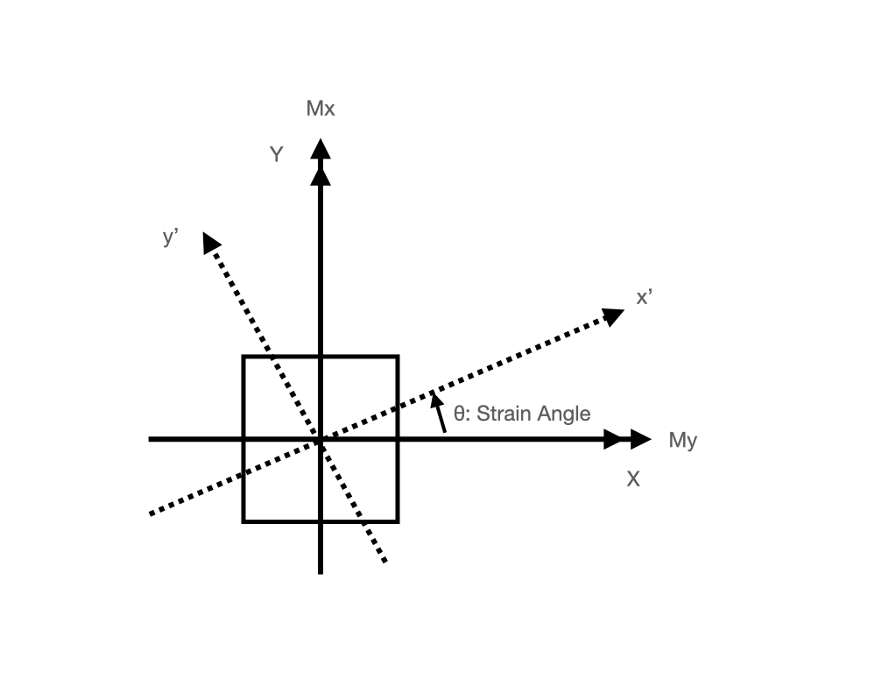

# fibGet
1-D Fiber Model Analysis


----------------


----------------

# Features
- Fiber Model Analysis for the reinforced concrete section
- Concrete: Fafitis and Shah Model
- Steel   : Bi-Linear Model
- Capable of making pdf report

----------------
# Table of content
- [1. Input data/Sample](#1-input-data-sample)
  - [1.1 control file](#11-control-file)
  - [1.2 section file](#12-section-file)
	- [1.2.1 MATE](#121-mate)
	- [1.2.2 CAPA](#122-capa)
	- [1.2.3 FIBE](#123-fibe)
	- [1.2.4 REBA](#124-reba)
- [2. Ouput](#2-output)
  - [2.1 mp file](#21-mp-file)
  - [2.2 cap file](#22-cap-file)
- [3. Report](#3-report)
- [4. Souse code](#4-source-code)
  - [4.1 Python Scripts](#41-python-scripts)
  - [4.2 Others](#42-others)
- [5. Usage](#5-usage)
  - [5.1 for unix](#51-for-unix)
  - [5.2 for Windows](#52-for-windows-with-pyinstaller)
  - [5.3 for Windows Recommend](#53-for-Windows-with-nuitka)
- [6. FibGet](#6-fibget)
- [Develop memo](#develop-memo)

----------------

# 1. Input data/ Sample

Two files are needed for the fiber analyis.

``` shell
> tree .
├── cntl.csv       ------> control file
├── sec
│    ├── sec.csv   ------> section file
├── result         ------> output dir. if needed
```

| file | example file name |
|:--|:--|
| control file | cntl.csv |
| section file | sec.csv |


## 1.1 control file
example csv data

``` txt
title, csvfile, theta, nn, ecumax, ndiv, ecu, esu, come, cuvmax, mumax, stressmax, strainmax, output, cal
CW10045,  ./sec/cw1.csv,    0.0, 8466, 0.003, 100, 0.003, 0.01, Fc60/20-D41(SD490), 2.0E-6, -99, -99, 0.02, ./result/CW10045, N
```

 | parameter | example            | remark                                             |
 |-----------|--------------------|----------------------------------------------------|
 | title     | CW10045            | title name                                         |
 | csvfile   | ./sec/cw1.csv      | input section file                                 |
 | theta     | 0.0                | angle of increment strain                          |
 | nn        | 8466.0             | Axial force in analysis                            |
 | ecumax    | 0.005              | maximum compressive strain in analysis             |
 | ndiv      | 100                | increment divided number                           |
 | ecu       | 0.003              | ultimate concrete strain limitation  for capacity  |
 | esu       | 0.01               | ultimate steel bar strain limitation for capacity  |
 | come      | Fc60/20-D41(SD490) | comment for report pdf                             |
 | cuvmax    | 2.0E-6             | graph control/(-99:auto): curvature (1/mm)         |
 | mumax     | -99                | graph control/(-99:auto): bending moment (kN.m)    |
 | stressmax | -99                | graph control/(-99:auto): steel bar stress (N/mm2) |
 | strainmax | 0.02               | graph control/(-99:auto): steel bar strain (-)     |
 | output    | ./result/CW10045   | output file name/ need make result dir.            |
 | cal       | Y or N             | Y: Done Analysis, N: Need Analysis                 |



----------------

## 1.2 section file

Four specified cards are needed for the csv section file.

| Item | Control for          |
| --   | :--                  |
| MATE | material select      |
| CAPA | allowable capacity   |
| FIBE | concrete fiber model |
| REBA | steel bar            |

### 1.2.1 MATE
material select
example

``` txt
#, type, parameter
MATE, 1, 42.0
MATE, 2, 490.0
```

| type      | remark                         |
|-----------|:-------------------------------|
| type      | material type number as bellow |
| parameter | parameter                      |

| type | parameter                | remark                                    |
|:-----|:-------------------------|:------------------------------------------|
| =1   | fc(compressive strength) | Concrete (Fafitis and Shah Model)         |
| =2   | fy(yield stress)         | Steel Bar ( Bi-Linear)                    |
| =3   | fc(compressive strength) | Concrete (Ignore tension based on num==1) |


### 1.2.2 CAPA
capacity control
example
``` txt
#,type_c,fc,type_s,fy
CAPA, 1, 28.0, 2, 490.0
```
| item   | unit  | remark                          |
|--------|:------|:--------------------------------|
| type_c | -     | type num. of concrete material  |
| fc     | N/mm2 | allowable concrete strength     |
| type_s | -     | type num. of steel bar material |
| fy     | N/mm2 | allowable steel bar strength    |

### 1.2.3 FIBE
Concrete fiber geometry data specified as the concrete fiber element by rectanglular shapes.

example data.
``` txt
#, xx1,yy1,xx2,yy2,ndimx,ndimy,fc_id
FIBE,     0.0,    0.0, 1000.0,  950.0,  20, 19, 0
FIBE,  1000.0,    0.0, 2000.0,  950.0,  20, 19, 0
FIBE,  2000.0,    0.0, 3000.0,  950.0,  20, 19, 0
FIBE,     0.0, 8500.0, 1000.0, 9450.0,  20, 19, 0
FIBE,  1000.0, 8500.0, 2000.0, 9450.0,  20, 19, 0
FIBE,  2000.0, 8500.0, 3000.0, 9450.0,  20, 19, 0
FIBE,  1000.0,  950.0, 2000.0, 8500.0,  20, 151, 0
```

| item      | unit | remark                     |
|:----------|:-----|:---------------------------|
| xx1       | mm   | x cordinate / lower left   |
| yy1       | mm   | y cordinate / lower left   |
| xx2       | mm   | x cordinate / higher right |
| yy2       | mm   | y cordinate / higher right |
| ndimx     | -    | divided num. for x-dir     |
| ndimy     | -    | divided num. for y-dir     |
| fc_id (*1 | _    | material num.              |

*1) fc_id -- num. of material card
``` txt
#, type, parameter
MATE, 1, 42.0    -----> num=0
MATE, 2, 490.0   -----> num=1
.                -----> num=2
.                -----> num=3
.                -----> num=4
.                -----> num=5
```


### 1.2.4 REBA
steel bar geometry data
example
``` txt
#, ids,nx,ny,dtx,dty,dia,fy_id
REBA, 0,  7, 7, 100, 100, D41, 1
REBA, 1,  7, 7, 100, 100, D41, 1
REBA, 2,  7, 7, 100, 100, D41, 1
REBA, 3,  7, 7, 100, 100, D41, 1
REBA, 4,  7, 7, 100, 100, D41, 1
REBA, 5,  7, 7, 100, 100, D41, 1
```
| item       | unit | remark                                                                                               |
|:-----------|:-----|:-----------------------------------------------------------------------------------------------------|
| ids (\*1   | -    | fiber element num. specified in "FIBE"                                                               |
| nx         | -    | bar num. in x-dir.                                                                                   |
| ny         | -    | bar num. in y-dir.                                                                                   |
| dtx        | mm   | distance the center of the bar from extreem compressive element specified rectanglar shape in x-dir. |
| dty        | mm   | distance the center of the bar from extreem compressive element specified rectanglar shape in y-dir. |
| dia        | -    | diameter of the steel bar , "D10" to "D41"                                                           |
| fy_id (\*2 | -    | material num.                                                                                        |

  


*1) ids num. of fibe card
``` txt
#, xx1,yy1,xx2,yy2,ndimx,ndimy,fc_id
FIBE,     0.0,    0.0, 1000.0,  950.0,  20, 19, 0  -----> num=0
FIBE,  1000.0,    0.0, 2000.0,  950.0,  20, 19, 0  -----> num=1
FIBE,  2000.0,    0.0, 3000.0,  950.0,  20, 19, 0  -----> num=2
FIBE,     0.0, 8500.0, 1000.0, 9450.0,  20, 19, 0  -----> num=3
FIBE,  1000.0, 8500.0, 2000.0, 9450.0,  20, 19, 0  -----> num=4
FIBE,  2000.0, 8500.0, 3000.0, 9450.0,  20, 19, 0  -----> num=5
FIBE,  1000.0,  950.0, 2000.0, 8500.0,  20, 151, 0 -----> num=6
```

*2) fy_id -- num. of material card
``` txt
#, type, parameter
MATE, 1, 42.0    -----> num=0
MATE, 2, 490.0   -----> num=1
.                -----> num=2
.                -----> num=3
.                -----> num=4
.                -----> num=5
```

----------------

# 2. Output

| outputfile  | content          | remark   |
|:------------|:-----------------|:---------|
| \*\*mp      | M-φ relationship | csv file |
| \*\*cap     | section capacity | csv file |
| \*model.png | model            | png file |
| \*mp.png    | M-φ relationship | png file |

## 2.1 mp file

Header
``` csv
p,mx,my,emax,emin,esmax,esmin,ec,xn
```

| item  | unit  | content                                                  | remark |
|:------|-------|----------------------------------------------------------|--------|
| p     | 1/mm  | curvature                                                |        |
| mx    | kN.m  | bending moment in x-dir.                                 |        |
| my    | kN.m  | bending moment in y-dir.                                 |        |
| emax  | N/mm2 | maximum stress in steel bar / compression bar            |        |
| emin  | N/mm2 | minimum stress in steel bar / testion bar                |        |
| esmax | -     | maximum strain in steel bar / compression bar            |        |
| esmin | -     | minimum strain in steel bar / tention bar                |        |
| ec    | -     | compressive strain of concrete at extreem fiber          |        |
| xn    | mm    | neutral axis distance from the extreem compressive fiber |        |


## 2.2 cap file

Header
``` csv
p,mx,my,emax,emin,esmax,esmin,ec,xn
```

| row | content            |
|:----|--------------------|
| 1   | crack stage        |
| 2   | allowable capacity |
| 3   | ultimate capacity  |

----------------

# 3. Report
fibGet give pdf report by pushing report button


----------------

# 4. Source code

coded by ptyhon

## 4.1 Python Scripts
``` SHELL
├── main.py
├── gui.py
├── fiber.py
├── aijRc.py
├── prop.py
├── store.py
├── report.py

```

## 4.2 Others
``` SHELL
├── gui.wxg
├── sample_data
│   ├── col_project
│   │   ├── Untitled.pdf
│   │   ├── cntl.csv
│   │   ├── input
│   │   │   └── c1.csv
│   │   └── result
│   └── project
│       ├── Untitled.pdf
│       ├── cntl.csv
│       ├── input
│       │   ├── beam.csv
│       │   ├── beam2.csv
│       │   ├── beam3.csv
│       │   ├── beam4.csv
│       │   ├── c2.csv
│       │   ├── cw1.csv
│       │   └── cw2.csv
│       └── result
├── db
├── fonts
│   └── GenShinGothic-Monospace-Medium.ttf
├── icon
│   ├── fibGet.ico
│   ├── fibGet.png
```

----------------

# 5. Usage

## 5.1 for unix
``` SHELL
> python3 main.py
```

## 5.2 For Windows with pyinstaller
By power shell
``` DOS
> pyinstaller main.py --onefile --noconsole --icon=icon/fibGet.ico
> cp ./icon ./dist/icon
> cp ./fonts ./dist/fonts
> mkdir ./dist/db
> ./dist/main/main.exe

```

## 5.3 For Windows with nuitka
By power shell

``` python
Change fibget.py, "GetPath()" -> "GetPaths()[0]
```

``` DOS
>nuitka --mingw64 --follow-imports --onefile --include-data-dir=.\fonts=fonts --include-data-dir=.\icon=icon --include-data-dir=.\db=db --windows-icon-from-ico=./icon/fibGet.ico main.py
>./main.exe
```


----------------

# 6. fibGet

fibGet.py

| class    | description                      |
|:---------|:---------------------------------|
| Fiber()  | calculation of the fiber model   |
| AftFib() | data organization after analysis |

## 6.1 Fiber

| method                            | description                                                       |
|:----------------------------------|-------------------------------------------------------------------|
| init(xx1,xx2,yy1,yy2,mate1,mate2) | init                                                              |
| limitation(kappa_min,kappa_max)   |                                                                   |
| rotation(idr,th)                  |                                                                   |
| getModel(xx1,xx2,...)             |                                                                   |
| viewModel(r_mmodel,...)           |                                                                   |
| viewModelRep(..)                  | make figure of the model to png file                              |
| viewModelGui(..)                  | make figure of the model to GUI                                   |
| createMatrix_steel(..)            | make matrix fo the steel bar                                      |
| createMatrix                      | make matrix of the concrete element                               |
| out                               | no use                                                            |
| out_add                           | no use                                                            |
| nn0                               | axial force by specified strain                                   |
| e0                                | compressive axial strain by specified axial force                 |
| view_sig_c                        | make conter figure by compressibe strain & neutral axis           |
| nnc_c                             | axial force by compressibe strain & neutral axis                  |
| mn                                | under develop                                                     |
| mn_ec_xn                          | bending moment and curvature by compressibe strain & neutral axis |
| xnn                               | curvature by comp. strain & axial force                           |
| make_cont                         | make conter figure by comp. strain                                |
| soslveBySt                        | bending moment by specified fiber                                 |
| mnGen                             | generate mn data                                                  |
| mxmy_double                       | mx-my relationship by ecu                                         |
| solve                             | M-p relationship by specified axial force                         |

### 6.1.1 init
| variable | description |
|:---------|-------------|
| xx1      |             |
| xx2      |             |
| yy1      |             |
| yy2      |             |
| mate1    |             |
| mate2    |             |

### 6.1.2 Fiber().limitation(kappa_min,kappa_max)


## 6.2 AftFib

----------------

# Develop memo

## 2022.01.28 modified, m_()_m
- modified script for the ultimate capacity at steel stress limitation.
- modifed linestyle, width, color in matplot

## 2023.04.30 modified, m_()_m
- modified fiber.py
- change "linewidth="0.5"" to to "linewidth=0.5"

# Memo

``` shell
Package                           Version
--------------------------------- ---------------
absl-py                           0.15.0
altgraph                          0.17
appnope                           0.1.3
argon2-cffi                       21.3.0
argon2-cffi-bindings              21.2.0
astunparse                        1.6.3
async-generator                   1.10
attrs                             21.4.0
backcall                          0.2.0
beautifulsoup4                    4.11.1
bleach                            4.1.0
cached-property                   1.5.2
cachetools                        4.2.4
certifi                           2021.10.8
cffi                              1.15.1
charset-normalizer                2.0.12
chromedriver                      2.24.1
chromedriver-binary               103.0.5060.53.0
clang                             5.0
cycler                            0.10.0
dataclasses                       0.8
decorator                         5.1.1
defusedxml                        0.7.1
entrypoints                       0.4
et-xmlfile                        1.0.1
flatbuffers                       1.12
gast                              0.4.0
geojson                           2.5.0
google-auth                       1.35.0
google-auth-oauthlib              0.4.6
google-pasta                      0.2.0
graphviz                          0.19.1
grpcio                            1.44.0
h5py                              3.1.0
idna                              3.3
importlib-metadata                4.8.3
ipykernel                         5.5.6
ipython                           7.16.3
ipython-genutils                  0.2.0
ipywidgets                        7.7.1
jdcal                             1.4.1
jedi                              0.17.2
Jinja2                            3.0.3
joblib                            1.1.0
jsonschema                        3.2.0
jupyter                           1.0.0
jupyter-client                    7.1.2
jupyter-console                   6.4.3
jupyter-contrib-core              0.3.3
jupyter-contrib-nbextensions      0.5.1
jupyter-core                      4.9.2
jupyter-highlight-selected-word   0.2.0
jupyter-latex-envs                1.4.6
jupyter-nbextensions-configurator 0.4.1
jupyterlab-pygments               0.1.2
jupyterlab-widgets                1.1.1
keras                             2.6.0
Keras-Preprocessing               1.1.2
kiwisolver                        1.3.1
lxml                              4.9.1
macholib                          1.14
Markdown                          3.3.6
MarkupSafe                        2.0.1
matplotlib                        3.3.2
mistune                           0.8.4
modulegraph                       0.18
mpmath                            1.1.0
nbclient                          0.5.9
nbconvert                         6.0.7
nbformat                          5.1.3
nest-asyncio                      1.5.5
notebook                          6.4.10
numpy                             1.19.4
oauthlib                          3.2.0
openpyxl                          3.0.5
opt-einsum                        3.3.0
packaging                         21.3
pandas                            1.1.5
pandocfilters                     1.5.0
parso                             0.7.1
pexpect                           4.8.0
pickleshare                       0.7.5
Pillow                            8.0.1
pip                               21.3.1
prometheus-client                 0.14.1
prompt-toolkit                    3.0.30
protobuf                          3.19.4
ptyprocess                        0.7.0
py2app                            0.22
pyasn1                            0.4.8
pyasn1-modules                    0.2.8
pycparser                         2.21
pydotplus                         2.0.2
Pygments                          2.12.0
pyinstaller                       4.1
pyinstaller-hooks-contrib         2020.10
pyparsing                         2.4.7
PyQt5                             5.15.2
PyQt5-sip                         12.8.1
pyrsistent                        0.18.0
python-dateutil                   2.8.1
pytz                              2020.5
PyYAML                            6.0
pyzmq                             23.2.0
qtconsole                         5.2.2
QtPy                              2.0.1
reportlab                         3.5.55
requests                          2.27.1
requests-oauthlib                 1.3.1
rsa                               4.8
scikit-learn                      0.24.2
scipy                             1.5.4
seaborn                           0.11.2
selenium                          3.141.0
Send2Trash                        1.8.0
setuptools                        59.6.0
Shapely                           1.8.0
six                               1.15.0
sklearn                           0.0
soupsieve                         2.3.2.post1
sympy                             1.7.1
tensorboard                       2.6.0
tensorboard-data-server           0.6.1
tensorboard-plugin-wit            1.8.1
tensorflow                        2.6.2
tensorflow-estimator              2.6.0
termcolor                         1.1.0
terminado                         0.12.1
testpath                          0.6.0
threadpoolctl                     3.1.0
tk                                0.1.0
tornado                           6.1
traitlets                         4.3.3
turfpy                            0.0.7
typing-extensions                 3.7.4.3
urllib3                           1.26.8
wcwidth                           0.2.5
webencodings                      0.5.1
Werkzeug                          2.0.3
wheel                             0.37.1
widgetsnbextension                3.6.1
wrapt                             1.12.1
wxPython                          4.1.0
xlrd                              2.0.1
zipp                              3.6.0
```
