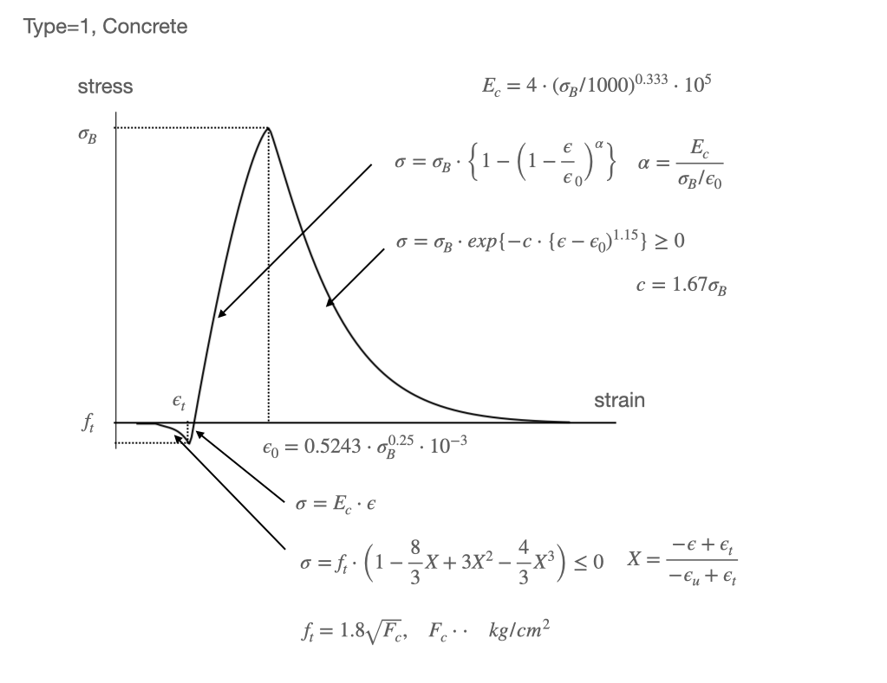
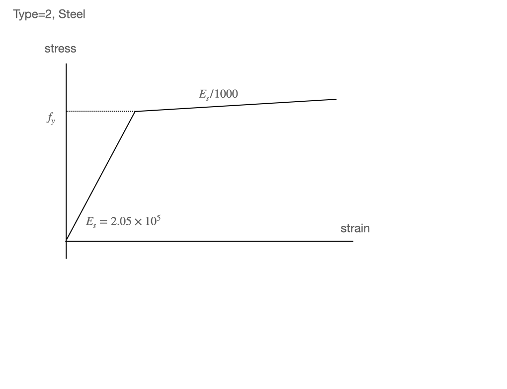
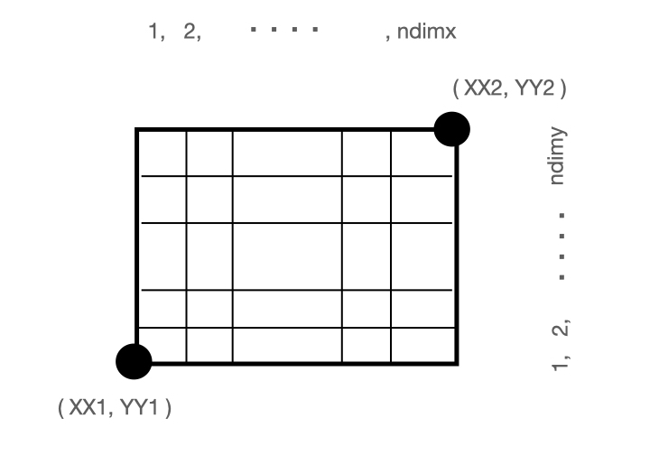
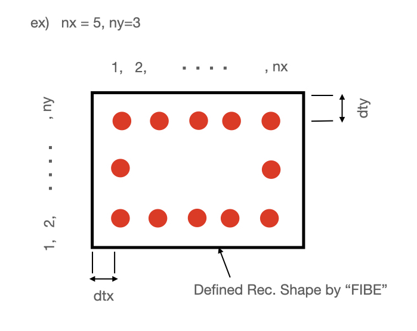
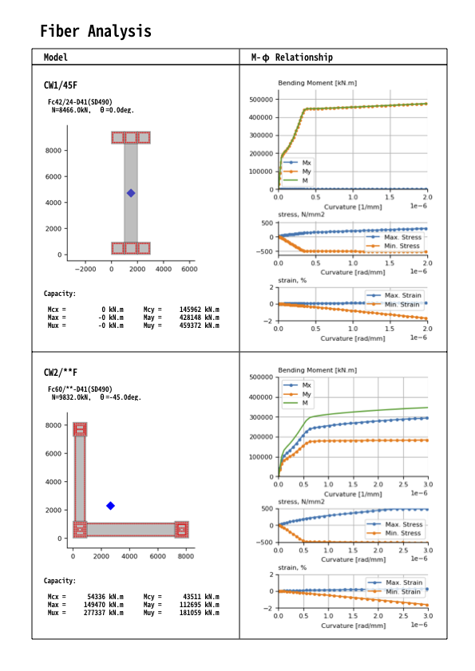

# fibGet
1-D Fiber Model Analysis


# Features
- Fiber Model Analysis for the reinforced concrete section
- Concrete: Fafitis and Shah Model
- Steel   : Bi-Linear Model
- Capable of making pdf report

----------------

# 1. Input data/ Sample

Two files are needed for the fiber analyis.

``` shell
> tree .
├── cntl.csv       ------> control file
├── sec
│    ├── sec.csv   ------> section file
├── result         ------> output dir. if needed
```

| file | example file name |
|:--|:--|
| control file | cntl.csv |
| section file | sec.csv |


## 1-1. control file
example csv data

``` txt
title, csvfile, theta, nn, ecumax, ndiv, ecu, esu, come, cuvmax, mumax, stressmax, strainmax, output, cal
CW10045,  ./sec/cw1.csv,    0.0, 8466, 0.003, 100, 0.003, 0.01, Fc60/20-D41(SD490), 2.0E-6, -99, -99, 0.02, ./result/CW10045, N
```

 | parameter | example            | remark                                             |
 |-----------|--------------------|----------------------------------------------------|
 | title     | CW10045            | title name                                         |
 | csvfile   | ./sec/cw1.csv      | input section file                                 |
 | theta     | 0.0                | angle of increment strain                          |
 | nn        | 8466.0             | Axial force in analysis                            |
 | ecumax    | 0.005              | maximum compressive strain in analysis             |
 | ndiv      | 100                | increment divided number                           |
 | ecu       | 0.003              | ultimate concrete strain limitation  for capacity  |
 | esu       | 0.01               | ultimate steel bar strain limitation for capacity  |
 | come      | Fc60/20-D41(SD490) | comment for report pdf                             |
 | cuvmax    | 2.0E-6             | graph control/(-99:auto): curvature (1/mm)         |
 | mumax     | -99                | graph control/(-99:auto): bending moment (kN.m)    |
 | stressmax | -99                | graph control/(-99:auto): steel bar stress (N/mm2) |
 | strainmax | 0.02               | graph control/(-99:auto): steel bar strain (-)     |
 | output    | ./result/CW10045   | output file name/ need make result dir.            |
 | cal       | Y or N             | Y: Done Analysis, N: Need Analysis                 |
----------------


## 1-2. csvfile/ section file

Four specified cards are needed.

| Item | Control for          |
| --   | :--                  |
| MATE | material select      |
| CAPA | allowable capacity   |
| FIBE | concrete fiber model |
| REBA | steel bar            |

### 1-2-1. MATE
material select
example

``` txt
#, type, parameter
MATE, 1, 42.0
MATE, 2, 490.0
```

| type      | remark                         |
|-----------|:-------------------------------|
| type      | material type number as bellow |
| parameter | parameter                      |

| type | parameter                | remark                                    |
|:-----|:-------------------------|:------------------------------------------|
| =1   | fc(compressive strength) | Concrete (Fafitis and Shah Model)         |
| =2   | fy(yield stress)         | Steel Bar ( Bi-Linear)                    |
| =3   | fc(compressive strength) | Concrete (Ignore tension based on num==1) |





### 1-2-2. CAPA
capacity control
example
``` txt
#,type_c,fc,type_s,fy
CAPA, 1, 28.0, 2, 490.0
```
| item   | unit  | remark                          |
|--------|:------|:--------------------------------|
| type_c | -     | type num. of concrete material  |
| fc     | N/mm2 | allowable concrete strength     |
| type_s | -     | type num. of steel bar material |
| fy     | N/mm2 | allowable steel bar strength    |

### 1-2-3. FIBE
Concrete fiber geometry data specified as the concrete fiber element by rectanglular shapes.

example data.
``` txt
#, xx1,yy1,xx2,yy2,ndimx,ndimy,fc_id
FIBE,     0.0,    0.0, 1000.0,  950.0,  20, 19, 0
FIBE,  1000.0,    0.0, 2000.0,  950.0,  20, 19, 0
FIBE,  2000.0,    0.0, 3000.0,  950.0,  20, 19, 0
FIBE,     0.0, 8500.0, 1000.0, 9450.0,  20, 19, 0
FIBE,  1000.0, 8500.0, 2000.0, 9450.0,  20, 19, 0
FIBE,  2000.0, 8500.0, 3000.0, 9450.0,  20, 19, 0
FIBE,  1000.0,  950.0, 2000.0, 8500.0,  20, 151, 0
```

| item      | unit | remark                     |
|:----------|:-----|:---------------------------|
| xx1       | mm   | x cordinate / lower left   |
| yy1       | mm   | y cordinate / lower left   |
| xx2       | mm   | x cordinate / higher right |
| yy2       | mm   | y cordinate / higher right |
| ndimx     | -    | divided num. for x-dir     |
| ndimy     | -    | divided num. for y-dir     |
| fc_id (*1 | _    | material num.              |

*1) fc_id -- num. of material card
``` txt
#, type, parameter
MATE, 1, 42.0    -----> num=0
MATE, 2, 490.0   -----> num=1
.                -----> num=2
.                -----> num=3
.                -----> num=4
.                -----> num=5
```




### 1-2-4. REBA
steel bar geometry data
example
``` txt
#, ids,nx,ny,dtx,dty,dia,fy_id
REBA, 0,  7, 7, 100, 100, D41, 1
REBA, 1,  7, 7, 100, 100, D41, 1
REBA, 2,  7, 7, 100, 100, D41, 1
REBA, 3,  7, 7, 100, 100, D41, 1
REBA, 4,  7, 7, 100, 100, D41, 1
REBA, 5,  7, 7, 100, 100, D41, 1
```
| item       | unit | remark                                                                                               |
|:-----------|:-----|:-----------------------------------------------------------------------------------------------------|
| ids (\*1   | -    | fiber element num. specified in "FIBE"                                                               |
| nx         | -    | bar num. in x-dir.                                                                                   |
| ny         | -    | bar num. in y-dir.                                                                                   |
| dtx        | mm   | distance the center of the bar from extreem compressive element specified rectanglar shape in x-dir. |
| dty        | mm   | distance the center of the bar from extreem compressive element specified rectanglar shape in y-dir. |
| dia        | -    | diameter of the steel bar , "D10" to "D41"                                                           |
| fy_id (\*2 | -    | material num.                                                                                        |

  


*1) ids num. of fibe card
``` txt
#, xx1,yy1,xx2,yy2,ndimx,ndimy,fc_id
FIBE,     0.0,    0.0, 1000.0,  950.0,  20, 19, 0  -----> num=0
FIBE,  1000.0,    0.0, 2000.0,  950.0,  20, 19, 0  -----> num=1
FIBE,  2000.0,    0.0, 3000.0,  950.0,  20, 19, 0  -----> num=2
FIBE,     0.0, 8500.0, 1000.0, 9450.0,  20, 19, 0  -----> num=3
FIBE,  1000.0, 8500.0, 2000.0, 9450.0,  20, 19, 0  -----> num=4
FIBE,  2000.0, 8500.0, 3000.0, 9450.0,  20, 19, 0  -----> num=5
FIBE,  1000.0,  950.0, 2000.0, 8500.0,  20, 151, 0 -----> num=6
```

*2) fy_id -- num. of material card
``` txt
#, type, parameter
MATE, 1, 42.0    -----> num=0
MATE, 2, 490.0   -----> num=1
.                -----> num=2
.                -----> num=3
.                -----> num=4
.                -----> num=5
```

## 2. Output

| outputfile  | content          | remark   |
|:------------|:-----------------|:---------|
| \*\*mp      | M-φ relationship | csv file |
| \*\*cap     | section capacity | csv file |
| \*model.png | model            | png file |
| \*mp.png    | M-φ relationship | png file |

### 2-1. \*\*mp file

Header
``` csv
p,mx,my,emax,emin,esmax,esmin,ec,xn
```

| item  | unit  | content                                                  | remark |
|:------|-------|----------------------------------------------------------|--------|
| p     | 1/mm  | curvature                                                |        |
| mx    | kN.m  | bending moment in x-dir.                                 |        |
| my    | kN.m  | bending moment in y-dir.                                 |        |
| emax  | N/mm2 | maximum stress in steel bar / compression bar            |        |
| emin  | N/mm2 | minimum stress in steel bar / testion bar                |        |
| esmax | -     | maximum strain in steel bar / compression bar            |        |
| esmin | -     | minimum strain in steel bar / tention bar                |        |
| ec    | -     | compressive strain of concrete at extreem fiber          |        |
| xn    | mm     | neutral axis distance from the extreem compressive fiber |        |


### 2-2. \*\*cap file

| row | content            |
|:----|--------------------|
| 1   | crack stage        |
| 2   | allowable capacity |
| 3   | ultimate capacity  |


## 3. Report
fibGet give pdf report by pushing report button



## 4. Source code

coded by ptyhon

### 4-1. Python Scripts
``` SHELL
├── main.py
├── gui.py
├── fiber.py
├── aijRc.py
├── prop.py
├── store.py
├── report.py

```

### 4-2. Others
``` SHELL
├── gui.wxg
├── sample_data
│   ├── col_project
│   │   ├── Untitled.pdf
│   │   ├── cntl.csv
│   │   ├── input
│   │   │   └── c1.csv
│   │   └── result
│   └── project
│       ├── Untitled.pdf
│       ├── cntl.csv
│       ├── input
│       │   ├── beam.csv
│       │   ├── beam2.csv
│       │   ├── beam3.csv
│       │   ├── beam4.csv
│       │   ├── c2.csv
│       │   ├── cw1.csv
│       │   └── cw2.csv
│       └── result
├── db
├── fonts
│   └── GenShinGothic-Monospace-Medium.ttf
├── icon
│   ├── fibGet.ico
│   ├── fibGet.png
```

## 5. Usage

### 5-1. for unix
``` SHELL
> python3 main.py
```

### 5-2. For Windows
By power shell
``` DOS
> pyinstaller main.py --onefile --noconsole --icon=icons/fibGet.ico
> mv ./icon ./dist/icon
> mv ./fonts ./dist/fonts
> ./dist/main/main.exe
```

# Develop memo
